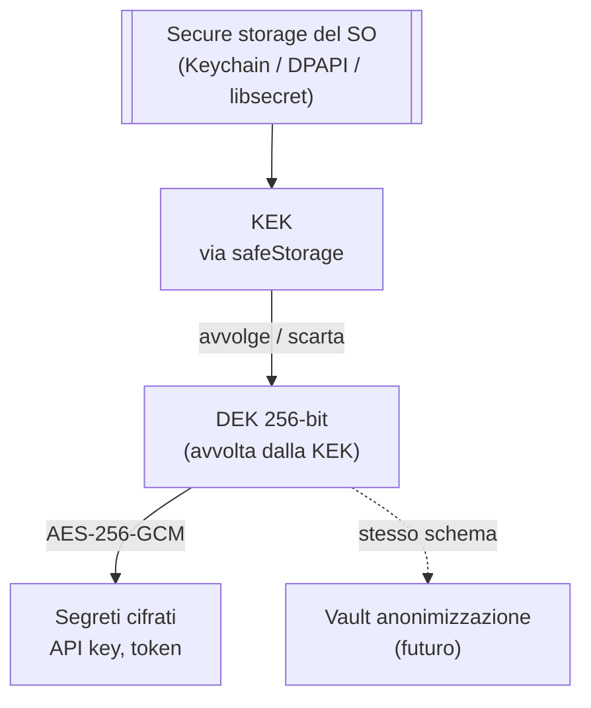

# Cifratura a riposo e gestione delle chiavi

Questo documento di design risolve i dettagli lasciati aperti dalla [sicurezza](../requisiti/sicurezza.md): quali algoritmi usare per la [cifratura](../glossario/cifratura.md) a riposo, dove conservare le chiavi, come derivarle e ruotarle, e come si protegge il vault dell'[anonimizzazione reversibile](./anonimizzazione-reversibile.md).
Le scelte sono coerenti con lo [stack TypeScript-first](./stack-tecnologico.md), con un'app [desktop Electron](./packaging-distribuzione.md) che gira **interamente in locale** ed è **single-utente**.

## Cosa si cifra e cosa no

La cifratura applicativa protegge i **segreti**: dati piccoli e ad alto valore che non devono mai comparire in chiaro.

- **Segreti** (cifrati dall'app): le [chiavi API](../modello-dati/chiave-api.md) dei [provider LLM](./provider-llm.md), i token e gli eventuali header di autenticazione degli endpoint; in una versione futura, il [vault dell'anonimizzazione](./anonimizzazione-reversibile.md).
- **Configurazione non segreta** (in chiaro nel [database applicativo](./database-applicativo.md)): provider scelto, `base_url`, id del modello, timeout. Vedi [gestione delle API key](./gestione-api-key.md).
- **Documenti dell'utente** (non cifrati file-per-file dall'app): i [documenti](../modello-dati/documento.md) nell'[archiviazione locale](./archiviazione-documenti.md) sono voluminosi e vengono aperti da strumenti esterni (la [conversione](./conversione-documenti.md) invoca LibreOffice), quindi cifrarli singolarmente nell'app aggiungerebbe complessità senza un guadagno reale. La loro protezione a riposo si appoggia alla **cifratura dell'intero disco del sistema operativo** (FileVault, BitLocker, LUKS) e alla conservazione **solo in locale**: nessun documento lascia la macchina.

Il modello è quindi a **due strati**: cifratura autenticata dei segreti a livello applicativo, cifratura del disco del SO per i dati voluminosi.

## Algoritmo a riposo: AES-256-GCM

I segreti sono cifrati con **AES-256-GCM**, cifratura **autenticata** (AEAD): oltre alla riservatezza garantisce l'**integrità**, così una manomissione del testo cifrato viene rilevata in fase di decifratura.
È fornita nativamente dal modulo `crypto` di **Node** (incluso in Electron), senza dipendenze aggiuntive.

Per ogni operazione di cifratura:

- si genera un **IV** casuale a 96 bit con il CSPRNG del sistema (`crypto.randomBytes`), mai riusato con la stessa chiave;
- si conserva l'**auth tag** a 128 bit accanto al testo cifrato;
- il record cifrato è auto-descrittivo e porta con sé un'**etichetta di versione**: `versione_schema`, `algoritmo`, `id_chiave`, `IV`, `tag`, `ciphertext`.

L'etichetta di versione dà **crypto-agility**: si può introdurre un algoritmo diverso o una nuova chiave e decifrare i record vecchi finché non vengono riscritti, senza migrazioni forzate «tutto o niente».

## Dove stanno le chiavi: cifratura a busta

Le chiavi seguono uno schema a **busta (envelope encryption)** a due livelli, per non ancorare direttamente ai dati un segreto gestito dal sistema operativo.

- **KEK (Key Encryption Key)** — non è materiale gestito da Magistra: è il **secure storage del sistema operativo**, raggiunto tramite l'API **`safeStorage`** di Electron. `safeStorage` usa il portachiavi nativo di ciascun OS: **Keychain** su macOS, **DPAPI** su Windows, **Secret Service** (libsecret) o **kwallet** su Linux. La protezione è ancorata alla sessione dell'utente del SO.
- **DEK (Data Encryption Key)** — una chiave casuale a 256 bit generata al **primo avvio** con il CSPRNG. È la chiave che cifra effettivamente i segreti con AES-256-GCM. Non è mai scritta in chiaro: viene **avvolta** (cifrata) dalla KEK via `safeStorage.encryptString` e salvata così, protetta, nella cartella dati dell'app (`userData`).

Al bisogno l'app chiede al SO di **scartare** la DEK (`safeStorage.decryptString`), la tiene in memoria per la sessione e la usa per cifrare/decifrare i segreti.

Perché due livelli invece di cifrare i segreti direttamente con `safeStorage`:

- **Rotazione economica della KEK**: cambiare la protezione del SO richiede solo di **ri-avvolgere la DEK**, non di ri-cifrare tutti i segreti.
- **Un solo punto ancorato al SO**: la dipendenza dal portachiavi è isolata dietro un confine, coerente con i [confini dietro interfacce](./stack-tecnologico.md); il resto è AES-256-GCM standard.
- **Robustezza del backend Linux**: su Linux `safeStorage`, se non trova un portachiavi disponibile, può ripiegare su una protezione debole. L'app **rileva il backend** attivo (`safeStorage.getSelectedStorageBackend()`) e, se la protezione forte non è disponibile, **avvisa l'utente** invece di dare per scontata una sicurezza che non c'è.

## Derivazione delle chiavi

Nell'MVP **non c'è una passphrase utente**: la DEK è **casuale**, non derivata da una password.
La protezione dei segreti è ancorata alla **sessione dell'utente del sistema operativo** tramite il portachiavi, coerente con un'app single-utente locale che non deve gestire login né infrastruttura (vedi [deployment](./deployment.md)).

Il **modello di minaccia** che questo copre e quello che non copre vanno detti con chiarezza:

- **Copre**: l'accesso ai file da parte di un altro account sulla stessa macchina e la lettura offline del disco di un account bloccato (il portachiavi non rilascia la KEK).
- **Non copre**: codice malevolo che gira **come lo stesso utente**, che ha per costruzione lo stesso accesso al portachiavi dell'app. È lo stesso confine di fiducia del secure storage del SO; nessuno schema locale può superarlo.

Come **evoluzione futura** (fuori dall'MVP) si può offrire una **passphrase opzionale** come ulteriore KEK: in quel caso la chiave si deriva con una funzione di derivazione a memoria elevata (**Argon2id**, in subordine scrypt), con parametri di costo tarati e salt casuale per resistere agli attacchi a forza bruta. Resta opzionale perché sposta sull'utente l'onere di ricordare un segreto che, se perso, rende i dati irrecuperabili.

## Rotazione e revoca

La rotazione è possibile a entrambi i livelli, con costi diversi:

- **Rotazione della KEK** — economica: si **ri-avvolge la DEK** con la nuova protezione del SO. I segreti non vengono toccati.
- **Rotazione della DEK** — si genera una nuova DEK e si **ri-cifrano i segreti**. È fattibile perché i segreti sono **pochi** (un pugno di chiavi API): non c'è un grande volume da riscrivere. Si esegue on-demand o al sospetto di una compromissione.
- **Revoca di un segreto** — una [chiave API](../modello-dati/chiave-api.md) compromessa si **revoca alla fonte** (dal cruscotto del provider) e si sostituisce in locale; la cancellazione del record cifrato la rimuove dall'app.

L'etichetta di versione su ogni record (vedi sopra) permette di ruotare la DEK **in modo incrementale**: i record restano leggibili con la chiave della loro versione finché non vengono riscritti con quella nuova.

## Protezione del vault di anonimizzazione

Il layer di [anonimizzazione reversibile](./anonimizzazione-reversibile.md) è **fuori dall'MVP**.
Quando e se verrà implementato, il suo **vault** (la mappatura segnaposto ↔ valore originale) è un insieme di segreti locali come gli altri: **riusa lo stesso schema** descritto qui (DEK, AES-256-GCM, cifratura a busta ancorata al secure storage del SO), senza un meccanismo separato.
Questo mantiene un unico punto di gestione delle chiavi per tutti i segreti dell'app.

## In transito

La cifratura in transito è distinta da quella a riposo trattata qui.
L'unico traffico in uscita è quello **opzionale** verso un [provider LLM](./provider-llm.md) remoto o l'[aggiornamento dell'indice](./distribuzione-indice.md), su **TLS** gestito dagli SDK client; non esiste comunicazione client-server interna, perché l'app gira tutta in locale e la UI parla col [backend](./backend-api.md) via IPC. Vedi [sicurezza](../requisiti/sicurezza.md).

## Sintesi delle scelte

| Aspetto | Scelta | Nota |
|---|---|---|
| Algoritmo a riposo | **AES-256-GCM** (AEAD) | Nativo in `crypto` di Node; riservatezza + integrità. |
| IV / tag | IV 96-bit casuale per operazione, tag 128-bit | Mai riusare l'IV con la stessa chiave. |
| Protezione della chiave | **Cifratura a busta**: KEK via `safeStorage`, DEK casuale avvolta | Keychain / DPAPI / Secret Service. |
| Derivazione | Nessuna passphrase nell'MVP; DEK casuale | Futuro opzionale: **Argon2id** su passphrase. |
| Rotazione | KEK: ri-avvolgi la DEK. DEK: ri-cifra i segreti | Volume piccolo; etichetta di versione per rotazione incrementale. |
| Vault anonimizzazione | Stesso schema, quando/se implementato | Fuori dall'MVP. |
| Documenti voluminosi | Cifratura del disco del SO + solo-locale | Non cifrati file-per-file dall'app. |
