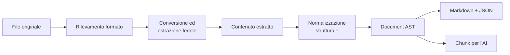

# Conversione documenti

Prepara i [documenti](../modello-dati/documento.md) caricati per l'uso da parte dell'assistente: converte i formati, estrae fedelmente il contenuto e costruisce una [rappresentazione strutturata](../modello-dati/documento-strutturato.md) indipendente dal formato sorgente.

La conversione in solo testo non è sufficiente per l'analisi: può confondere titoli e paragrafi, alterare l'ordine delle colonne, appiattire le tabelle e perdere i riferimenti alle pagine.
La pipeline conserva quindi sia una vista leggibile sia una struttura verificabile destinata a ricerca semantica e RAG.

## Pipeline

## Confine tra estrazione e normalizzazione

Il rilevamento del formato, la conversione e l'estrazione fedele costituiscono il primo livello della pipeline.
Questo livello espone testo, pagine, blocchi e tutte le informazioni strutturali disponibili nella fonte, senza ridurre il risultato a una sola stringa quando il formato permette una rappresentazione più ricca.

La normalizzazione strutturale utilizza quel risultato come input: non converte nuovamente il file e non reimplementa gli estrattori.
Mappa invece le informazioni disponibili nel [Documento strutturato](../modello-dati/documento-strutturato.md), applica regole deterministiche e genera gli artefatti pronti per l'AI destinati all'analisi.

## Responsabilità

- **Estrazione fedele** da PDF e formati Office, conservando titoli, paragrafi, elenchi, tabelle, note, pagine e ordine di lettura quando disponibili.
- **Conversione di formato** (DOC/DOCX ↔ PDF) per la visualizzazione e per l'esportazione delle bozze redatte.
- **Normalizzazione deterministica** di Unicode, spazi, ritorni a capo artificiali, sillabazioni e intestazioni o piè di pagina ripetuti, senza riscrivere il contenuto.
- **Riconoscimento in fase di estrazione dei PDF scansionati o misti** e invio all'estrazione OCR delle sole pagine prive di un livello testuale utilizzabile.
- **Produzione degli artefatti strutturati** Markdown, JSON e chunk, tutti riconducibili al file originale.
- Output formattato per casi particolari, compreso l'orientamento orizzontale per checklist e tabelle.

## Strategia per formato

- Per DOCX l'estrattore espone la struttura nativa del file: stili dei titoli, paragrafi, elenchi, tabelle, collegamenti, intestazioni e piè di pagina.
- LibreOffice headless genera i formati derivati e preserva la resa visuale, ma non è l'unica sorgente del testo dei DOCX.
- Per PDF digitali l'estrattore conserva blocchi, pagine e dati necessari a ricostruire l'ordine di lettura; la semplice concatenazione del testo non costituisce un risultato completo.
- Per PDF scansionati o misti l'OCR è selettivo per pagina; ogni blocco riconosciuto registra metodo e confidenza.

## Confine di LibreOffice

LibreOffice headless è invocato come sottoprocesso isolato con input e output su file, directory temporanea e profilo separati per job, timeout e cancellazione.
Un blocco o un errore del sottoprocesso non deve bloccare l'assistente e gli artefatti temporanei vengono ripuliti al termine.

## Separazione dalla generazione AI

La conversione e la normalizzazione preservano il contenuto originale e non usano un LLM per correggerlo, riassumerlo o riformularlo.
Qualsiasi semplificazione semantica è una fase successiva e opzionale, non sovrascrive l'estrazione fedele e mantiene riferimenti verificabili ai blocchi originali.

## Relazioni

- Alimenta l'[analisi di documenti](../funzionalita/analisi-documenti.md), la [revisione tabellare](../funzionalita/revisione-tabellare.md) e la [redazione](../funzionalita/redazione-documenti.md).
- I file di origine e i derivati risiedono nell'[archiviazione locale](./archiviazione-documenti.md).

> Nota: la conversione del **corpus normativo** è cosa diversa — quella avviene nella [pipeline di trasformazione](../modello-dati/pipeline-trasformazione.md) a partire da [Akoma Ntoso](../glossario/akoma-ntoso.md). Qui si tratta dei documenti **dell'utente**.
