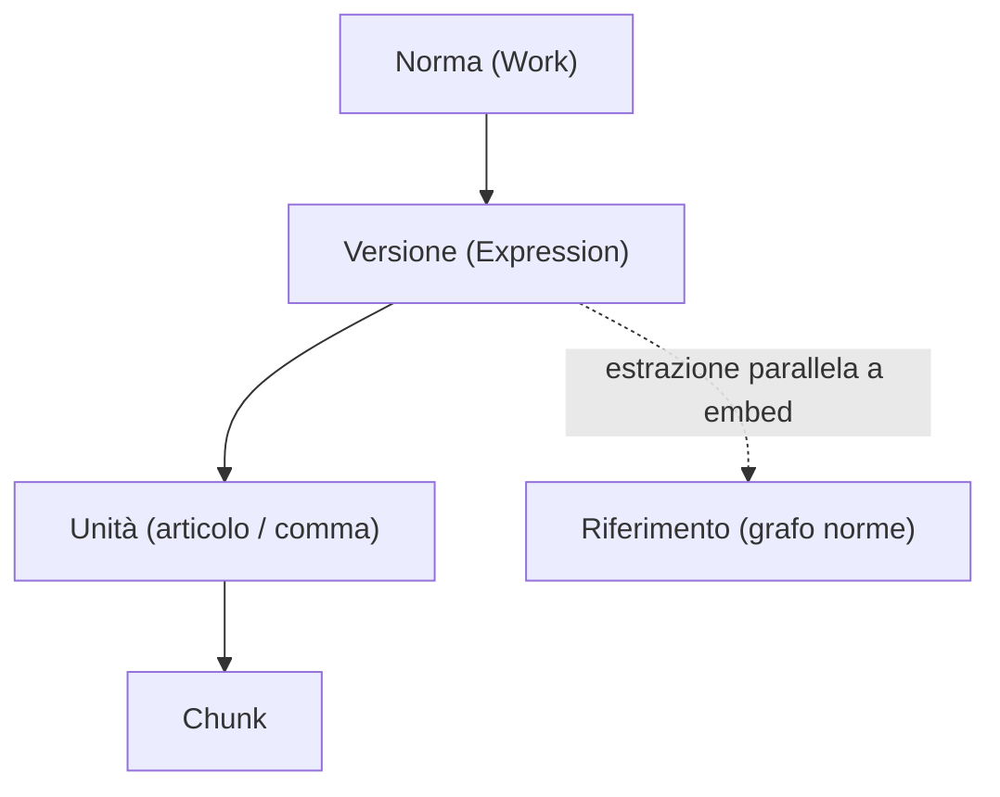

# Pipeline di trasformazione, panoramica

Trasforma dati da [Normattiva Open Data](https://dati.normattiva.it/) (Akoma Ntoso / ELI) in un indice interrogabile con citazioni verificabili.

**Stato:** bozza v0.1. Vedi [Come leggere](/architettura/pipeline/leggere.md).

## Perché prima della pipeline, non pgvector

pgvector memorizza vettori su **righe già definite**. Senza accordo su chunk, metadati di citazione e vigenza, il primo schema e il primo embed vanno probabilmente rifatti.

**Ordine di lavoro:**

1. Ingest → parse → normalize → chunk → persistenza righe (senza vettori)
2. Validazione su MVP pilota
3. Solo allora pgvector + embedding
4. **Estrazione riferimenti** in parallelo al percorso chunk → embed: dipende da testo/AKN già normalizzato, non dagli embedding

## Modello dati in uscita

Dettaglio entità: [Norma](/modello-dati/norma.md), [Versione](/modello-dati/versione.md), [Unità](/modello-dati/unita.md), [Chunk](/modello-dati/chunk.md), [Riferimento](/modello-dati/riferimento.md).

## Fasi

Vedi [indice pipeline](/architettura/pipeline/index.md). L'[estrazione riferimenti](/architettura/pipeline/estrazione-riferimenti.md) non dipende dagli embedding: può procedere dopo [normalizzazione](/architettura/pipeline/normalizzazione.md), in parallelo a chunk e embed.

## Chiavi naturali (deduplicazione)

| Entità | Chiave |
|--------|--------|
| Norma | `eli` |
| Versione | `eli` + `vigenza_da` + `vigenza_a` + `stato` |
| Unità | `versione_id` + `percorso` (path AKN) |
| Chunk | `unita_id` + `chunk_seq` |
| Riferimento | `da_eli` + `a_eli` + `tipo` + contesto unità |

## Gate di qualità

### Gate 1 (post-parse)

- XML valido; FRBR/ELI presenti
- Fallimento → quarantena, nessun passo a valle

### Gate 2 (post-normalize)

- Almeno un'unità articolo/comma con testo
- Intervallo vigenza coerente

### Gate 3 (pre-index)

Metadati obbligatori per citazione:

- `eli`
- tipo unità + `numero` (es. art. 3, comma 2)
- `vigenza_da` (+ `vigenza_a` se versione chiusa)
- `testo` non vuoto

| Ambiente | Comportamento |
|----------|---------------|
| **Produzione (G1)** | Chunk incompleto → **respinto**, non indicizzato |
| **Dev (G2)** | Chunk incompleto → **quarantena** per debug ingest |

## Chunking

- Default: **1 comma = 1 chunk**
- Se comma supera soglia token → split in sub-chunk con stessi metadati citazione
- Soglia: **`MAX_CHUNK_TOKENS` = TBD** (dipende dal modello embedding scelto nel pilota)

## Vigenza nel retrieval

- `query_date` opzionale; se assente → **oggi**
- Filtro: testo con valore alla data richiesta (`vigenza_da ≤ date` e `vigenza_a` null o `≥ date`)
- Ricerca storica esplicita su altre date: **TBD fase 2**

## Embedding (TBD post-pilota)

- Interfaccia **`EmbeddingProvider`** swappabile (`model_id`, `dimensions`)
- Scelta modello **dopo** pilota sul sottoinsieme MVP (golden queries, hit@k, citazioni)
- Cambio `model_id` → **re-embed completo** dell'indice
- I chunk devono rispettare `max_tokens` del modello attivo

## Normalizzazione testo

- Nessuna alterazione del significato normativo
- Trasformazioni consentite solo se reversibili e loggate (spazi, unicode, markup AKN)

## Confine con API layer

Retrieval come servizio separato (**H1**). Dettaglio: [contratto-retrieval-api.md](/architettura/pipeline/contratto-retrieval-api.md). Shortcut H3 in dev: **TBD con il team**.

## Responsabilità

| Perimetro | Ruolo |
|-----------|-------|
| Data plane / pipeline | Ingest, parse, chunk, index write, retrieval service |
| API layer | HTTP pubblico, auth, orchestrazione RAG, LLM, upload utente |

Responsabile ingest: **TBD**.

## De-risking (sintesi)

| Rischio | Mitigazione v0.1 |
|---------|------------------|
| Vigenza errata | Filtro data nel retrieval; golden queries con date |
| Chunk senza citazione | Gate G1/G2 |
| Drift Normattiva | Quarantena post-parse; versione parser |
| Modello embedding sbagliato | Decisione post-pilota; interfaccia swappabile |
| API e pipeline sullo stesso DB senza confine | H1 + contratto |

## Prossimi passi

1. Allineamento team su contratto API e H3 dev
2. Vertical slice sul sottoinsieme MVP senza vettori
3. Golden queries (**TBD**)
4. Scelta embedding (**TBD**)
5. pgvector + smoke retrieval
