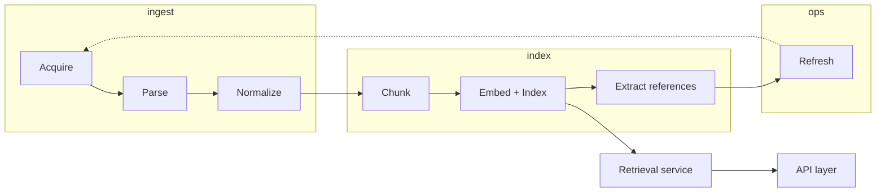

# Pipeline di trasformazione

Entry point del **data plane**. Leggere prima: [Come leggere](/modello-dati/pipeline/leggere.md).

## Diagramma

## Fasi

| # | Fase | Documento |
|---|------|-----------|
| 1 | Acquire | [acquire.md](/modello-dati/pipeline/acquire.md) |
| 2 | Parse | [parse.md](/modello-dati/pipeline/parse.md) |
| 3 | Normalize | [normalize.md](/modello-dati/pipeline/normalize.md) |
| 4 | Chunk | [chunk.md](/modello-dati/pipeline/chunk.md) |
| 5 | Embed + Index | [embed-index.md](/modello-dati/pipeline/embed-index.md) |
| 6 | Extract references | [extract-references.md](/modello-dati/pipeline/extract-references.md) |
| 7 | Refresh | [refresh.md](/modello-dati/pipeline/refresh.md) |

## Documenti trasversali

- [Pipeline, panoramica e principi](/modello-dati/pipeline/pipeline-di-trasformazione.md)
- [Contratto retrieval ↔ API](/modello-dati/pipeline/contratto-retrieval-api.md)

## Principio cardine (DECISO)

> Ogni chunk in indice deve permettere una citazione verificabile: ELI + articolo/comma + vigenza. **In produzione, senza metadati completi il chunk non entra in indice (G1).**

## MVP pilota (DECISO)

Allineato ad [Ambito MVP](/requisiti/mvp.md): ingest di un **sottoinsieme** del corpus da Normattiva, sufficiente a validare ingest, chunk, citazioni e retrieval prima di scalare.

- **Ambito:** sottoinsieme del corpus (non l'intero catalogo Normattiva)
- **Pilota implementativo:** insieme ristretto di atti scelto dal team (es. L. 241/1990 tra gli altri); può includere più atti e più versioni dove servono i test
- **Percorso:** acquire → … → chunk → righe DB; pgvector **dopo** che righe e metadati sono corretti
- **Fixture eval:** golden queries con ELI/articolo/comma attesi (**TBD**, chi le scrive)